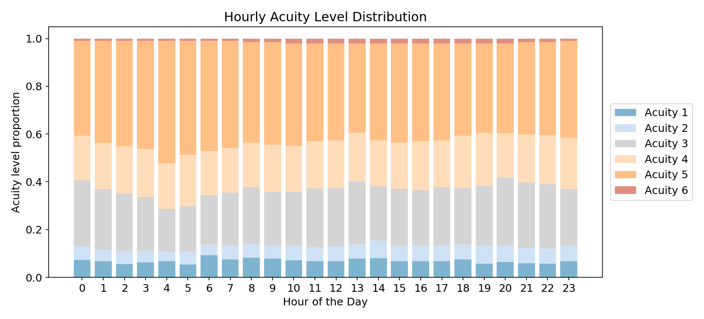

# Emergency Department Staffing Optimization
## Background
This analysis recreates an Emergency Department (ED) patient arrival environment as described by 
S. Ganguly, S. Lawrence, and M. Prather in their paper "Emergency Department 
Staff Planning to Improve Patient Care and Reduce Costs" published in 
Decision Science, Vol. 45, No. 1, February 2014.

In the Computational Example section of their paper, they present the data in Figure 1 as
a realistic example of hourly patient arrivals and acuity levels at an ED.

The patient arrivel means and Coefficients of Variance (standard deviation / mean) 
are calculated hourly, and the distributions of patient acuity levels (1-6) are 
shown by the relative heights of the shaded regions in the figure.

## Goal
Using data provided in Figure 1, create a daily patient arrival simuation for an ED.  

## Replicating the distributions
The data in Figure 1 was digitized using the online tool 
[graphreader.com](http://www.graphreader.com/) and stored in the `./data/` 
directory.  It was read by the script `./src/make_patient_arrival_distribution.py` 
to create two distributions.  The first distribution is the average and standard 
deviation of hourly patient arrivals shown in Figure 2 below.
 
#### Figure 2:

This figure is similar to Figure 1 except that the Coefficient of Variance has been
transformed into the standard deviation at each hour, as represented by the black line
overlaid on the mean number of arrivals.

The second distribution is the proportion of arrivals of each acuity level at 
each hour, as shown by Figure 3.
 
#### Figure 3:

Though presenting the same information as Figure 1, Figure 3 is notable in that 
it illustrates that the number of acuity level 5 arrivals is roughly equal to 
the sum of the acuity level 3 and 4 arrivals, and that the number of acuity 
level 6 arrivals grows in the afternoon but still remains small throughout the 
entire day.

## Simulating daily patient arrivals  
The distributions in Figures 2 and 3 were used in a Monte Carlo simulation to create
representative daily patient arrivals and acuity levels.  The script `./src/simulate_daily_patient_arrivals.py` creates one daily simulation, and has the option
to provide as many daily simulations as required.  Figure 4 shows an example of single day 
output.
 
#### Figure 4:

In this simulation no patients arrived at 5 and 7 am, and one acuity level 6 patient 
arrived at 11 am.  Acuity level 5 is most heavily represented throughout the day.

Figure 5 shows an example of multi-day output.  In this case, 5 days are simulated.
 
#### Figure 5:  
  

The number of arrivals per hour can vary widely.  This is no surprise as Figure 2 shows
that hourly values have high variance. 

## Next steps
Years of patient arrival scenarios could be created using these scripts, and staffing plans could
be proposed meeting cost, service level, and wait-time constraints.  The authors of the paper
use an optimization method based on constraints associated with service level and cost to
arrive at the best staffing plan.  I would like to try a simpler approach initially: propose
a manageable, finite set of staffing plans and see how each plan performs in terms of cost,
service level, and patient wait-times.  It's been my experience that these optimums
are often broad, meaning that costs are likely similar for a diverse set of plans, and
so the "best" staffing plan according multiple metrics might not be the one 
solution identified by the model. Running multiple staffing scenarios and sorting 
by performance will allow alternative plans to be identified.